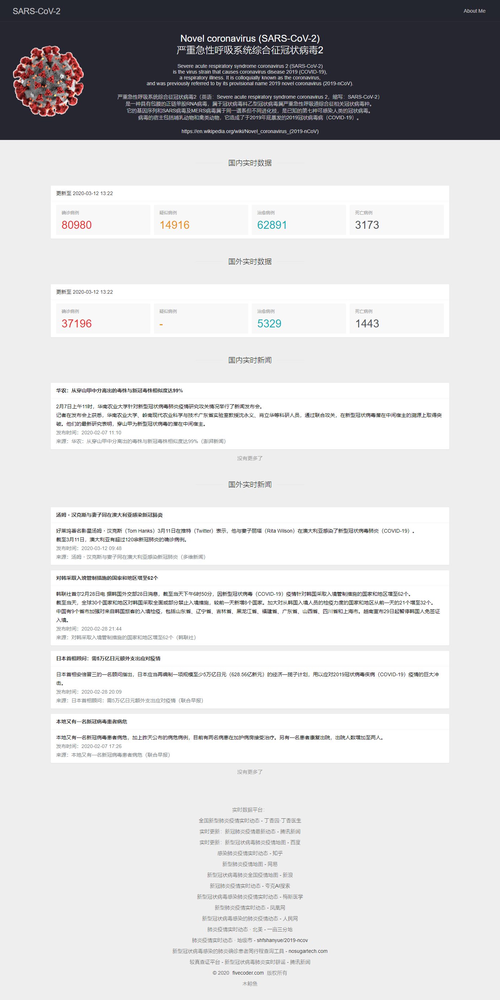
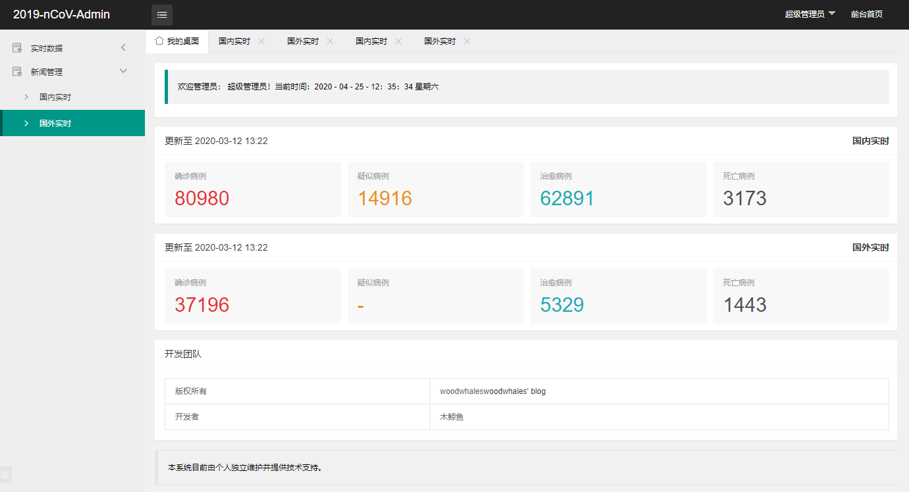

# 2019-nCoV 疫情实时动态

[](https://woodwhales.cn/) 
 
> https://fivecoder.com/2019-ncov/

## 运行指南

环境要求：JDK 1.8+

技术支持：Spring Boot + Spring Security + Thymeleaf + layui + x-admin

运行 src\main\resources\sql\2019-ncov.sql 脚本，修改 src\main\resources\application-dev.yml 脚本中数据库配置。

使用 maven 命令编译打包：

```shell
mvn clean install 
```

进入 target 目录执行 jar 文件：

```shell
java -jar 2019-nCoV.jar
```

浏览器访问：

前端：http://127.0.0.1:8088/2019-ncov/

后台：http://127.0.0.1:8088/2019-ncov/admin/login

> sql 脚本中默认初始化了俩个用户账号及角色：
>
> 超级管理员账号：admin，密码：admin
>
> 普通管理员账号：woodwhales，密码：user

## 页面效果展示

### 前端系统



### 后台管理



